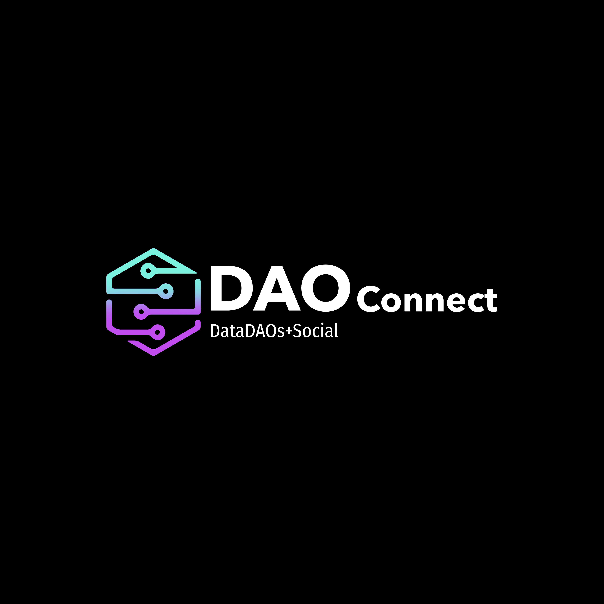

# DAOCONNECT 

[Read the Developer Blog Post - Pt 1.](Blog/Blog-pt-1.md)

## DAOCONNECT Table of Contents

- [DAOCONNECT](#daoconnect)
  - [Description](#description)
  - [Decentralization and Collective Ownership](#decentralization-and-collective-ownership)
  - [Private and Secure Social Interactions](#private-and-secure-social-interactions)
  - [Decentralized Storage](#decentralized-storage)
  - [User Management](#user-management)
  - [About DataDAO's](#about-datadaos)
    - [What is a DAO?](#what-is-a-dao)
    - [What is a dataDAO?](#what-is-a-datadao)
    - [How is it beneficial over a Traditional Social Platform?](#how-is-it-beneficial-over-a-traditional-social-platform)

- [Read more about DataDAO's by CLICKING HERE](DataDAOs.md)

## DESCRIPTION
"DataConnect is a revolutionary social platform powered by DataDAOS, leveraging the decentralized storage capabilities of Filecoin. It provides a secure and privacy-focused environment for users to connect, share, and collaborate. With DataConnect, users can seamlessly upload and share files, ranging from images to videos and documents, while retaining complete control over their data.

### Approach 
My goal was to build a simple social platform similar to twitter or instagram where user’s could create profiles and interact with posts utilizing filecoins protocol for decentralized storage of images and other media files uploaded by users as well as ComposeDB/Ceramic which is a decentralized database provider utilizing graphQL for storing the social interactions. 

#### Benefits
The main benefit of this approach to data management is user’s can share files while retaining complete control over their data empowering user’s with ownership and governance through the DAO implementation.

##### Lessons Learned / Thoughts
With more than 3-4 days to build, I strongly believe that my project would have been a very strong contender for the top prize , I learned/implemented everything from reading the Filecoin/ComposeDB documentation and am truly surprised by my ability to accomplish what I did and  thankful for the growth from the experience.

## Decentralization and Collective Ownership
Built on the principles of decentralization, DataConnect empowers users with ownership and governance of their content. Through DataDAOS, users collectively manage and govern the platform, shaping its rules and policies through community-driven decision-making.

## Private and Secure Social Interactions
DataConnect fosters a vibrant and engaged community, enabling social interactions such as comments, likes, and follows. Users can discover and connect with like-minded individuals, forming meaningful connections within a decentralized ecosystem. By integrating decentralized identity solutions, DataConnect ensures user privacy and enables secure authentication.

## Decentralized Storage
With DataConnect, your data is securely stored on the robust Filecoin network, ensuring resilience, redundancy, and long-term data integrity. Embracing the power of decentralized storage, DataConnect revolutionizes social networking, offering a seamless user experience while empowering users to reclaim control over their personal data.

Join DataConnect today and experience a social platform that prioritizes privacy, data ownership, and community governance like never before."

## Architecture 

### Vue Project Architecture

## User Management & Authentication

The backend API can integrate with a decentralized identity provider for secure authentication. User profile information is stored in a user database, associated with unique user identifiers.

## ABOUT DATADAO'S

### What is a Dao?
A DAO, which stands for Decentralized Autonomous Organization, is an organization that operates based on smart contracts and blockchain technology. It is designed to be autonomous, decentralized, and governed by its participants rather than a central authority. A DAO's rules and decision-making processes are typically encoded in smart contracts, which are executed automatically and transparently on the blockchain. This allows for greater transparency, trust, and participation among DAO members.

### What is a dataDAO?
A DataDAO, or Data Decentralized Autonomous Organization, is a specific type of DAO that focuses on managing and governing data in a decentralized manner. It leverages blockchain technology to provide secure, transparent, and auditable data storage, sharing, and access mechanisms. DataDAOs aim to address the challenges associated with centralized data platforms by enabling individuals to have ownership and control over their own data, while still allowing for collaboration and data sharing within the network.

### How is it beneficial over a traditional social platform?
- Data Ownership and Control
- Transparrency and Trust 
- Data Security 
- Incentivization and Rewards
- Community Governance

Overall, DataDAOs aim to empower individuals, protect their data rights, and create more equitable and transparent data ecosystems compared to traditional social platforms.

Read more about dataDAO's by [CLICKING HERE](DataDAOs.md)

## Technologies Used 
- FEVM
- Hardhat 
- React
- Node
- Vue.js
- Ceramic/ComposeDB
- Smart Contracts
- Remix IDE

## User Stories 
As a user, I want to create a unique profile on the platform, upload a profile picture, and provide a bio to express my identity and interests.

As a user, I want to share photos, videos, and documents with my friends and followers on the platform, making it easy to upload and organize my content.

As a user, I want to interact with others by leaving comments, liking their content, and sharing interesting posts with my network.

As a user, I want control over my privacy settings, allowing me to choose who can see my content, manage follower requests, and customize my privacy preferences.

As a user, I want to have a seamless and visually appealing user interface that provides a great user experience on both desktop and mobile devices.

[Read the Developer Blog Post - Pt 1.](Blog/Blog-pt-1.md)