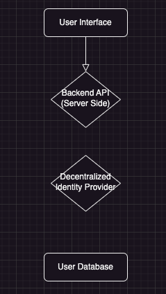
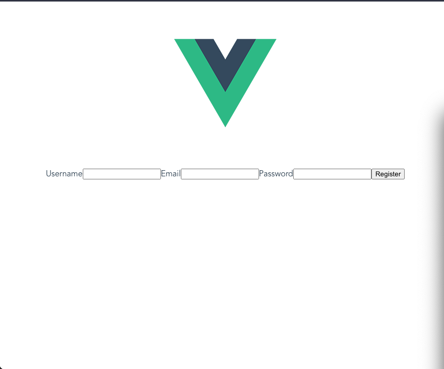
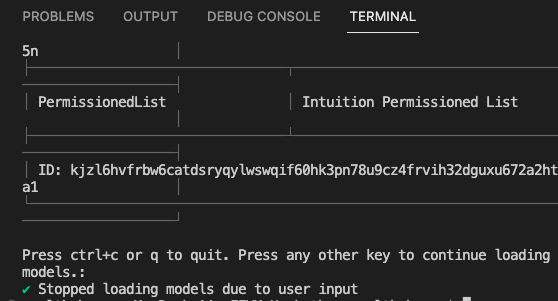
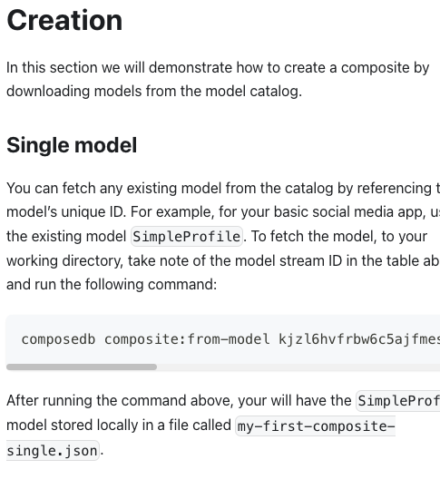
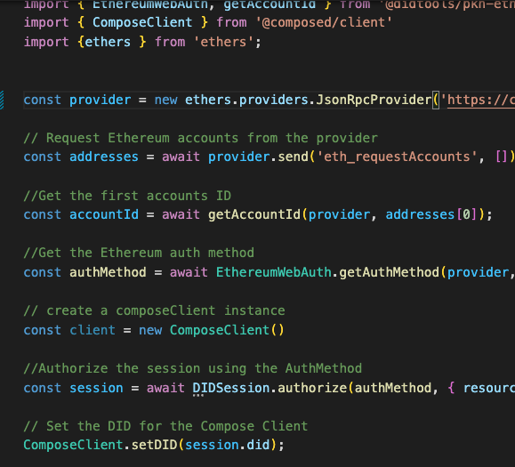

# DAOCONNECT 

## DAOCONNECT Table of Contents

- [DAOCONNECT](#daoconnect)
  - [Description](#description)
  - [Decentralization and Collective Ownership](#decentralization-and-collective-ownership)
  - [Private and Secure Social Interactions](#private-and-secure-social-interactions)
  - [Decentralized Storage](#decentralized-storage)
  - [User Management](#user-management)
  - [About DataDAO's](#about-datadaos)
    - [What is a DAO?](#what-is-a-dao)
    - [What is a dataDAO?](#what-is-a-datadao)
    - [How is it beneficial over a Traditional Social Platform?](#how-is-it-beneficial-over-a-traditional-social-platform)

- [Read more about DataDAO's by CLICKING HERE](DataDAOs.md)

## DESCRIPTION
"DataConnect is a revolutionary social platform powered by DataDAOS, leveraging the decentralized storage capabilities of Filecoin. It provides a secure and privacy-focused environment for users to connect, share, and collaborate. With DataConnect, users can seamlessly upload and share files, ranging from images to videos and documents, while retaining complete control over their data.

## Decentralization and Collective Ownership
Built on the principles of decentralization, DataConnect empowers users with ownership and governance of their content. Through DataDAOS, users collectively manage and govern the platform, shaping its rules and policies through community-driven decision-making.

## Private and Secure Social Interactions
DataConnect fosters a vibrant and engaged community, enabling social interactions such as comments, likes, and follows. Users can discover and connect with like-minded individuals, forming meaningful connections within a decentralized ecosystem. By integrating decentralized identity solutions, DataConnect ensures user privacy and enables secure authentication.

## Decentralized Storage
With DataConnect, your data is securely stored on the robust Filecoin network, ensuring resilience, redundancy, and long-term data integrity. Embracing the power of decentralized storage, DataConnect revolutionizes social networking, offering a seamless user experience while empowering users to reclaim control over their personal data.

Join DataConnect today and experience a social platform that prioritizes privacy, data ownership, and community governance like never before."

# User Management

The backend API can integrate with a decentralized identity provider for secure authentication. User profile information is stored in a user database, associated with unique user identifiers.

## ABOUT DATADAO'S

### What is a Dao?
A DAO, which stands for Decentralized Autonomous Organization, is an organization that operates based on smart contracts and blockchain technology. It is designed to be autonomous, decentralized, and governed by its participants rather than a central authority. A DAO's rules and decision-making processes are typically encoded in smart contracts, which are executed automatically and transparently on the blockchain. This allows for greater transparency, trust, and participation among DAO members.

### What is a dataDAO?
A DataDAO, or Data Decentralized Autonomous Organization, is a specific type of DAO that focuses on managing and governing data in a decentralized manner. It leverages blockchain technology to provide secure, transparent, and auditable data storage, sharing, and access mechanisms. DataDAOs aim to address the challenges associated with centralized data platforms by enabling individuals to have ownership and control over their own data, while still allowing for collaboration and data sharing within the network.

### How is it beneficial over a traditional social platform?
- Data Ownership and Control
- Transparrency and Trust 
- Data Security 
- Incentivization and Rewards
- Community Governance

Overall, DataDAOs aim to empower individuals, protect their data rights, and create more equitable and transparent data ecosystems compared to traditional social platforms.

Read more about dataDAO's by [CLICKING HERE](DataDAOs.md)

# Blog

## Intro

## Setup

I chose Vue for my frontend due to the ease of use and simple setup for smaller applications.
I wanted to get an MVP up as quickly as possible as I only entered the hackathon just a few days before it was set to end on May 23rd. So basically I entered into a 3-4 Day Sprint.

### Project Ideation
I wanted to build something that the Hackathon organizers Filecoin actually requested and DataDAO's were high on that list. Having prior experience being a part of DAO's, it seemed interesting building something based on this new concept or at least it was new to me. The difference lies in that one focuses on the organization itself while the latter focuses on Data more importantly.

## User Auth & Management 

### Ceramic Setup

#### First failed attempt using NPM manually.

####  Failed Attempt using Wheel

#### Miraculously Getting it Working - Yay!

#### Accessing Examples Models - 

### Creating the composite

### Compiling the composite

### Deploying the composite 
[deployed]()

### Started graphQL server 

### Indexing Models
[Index]()

### Login
